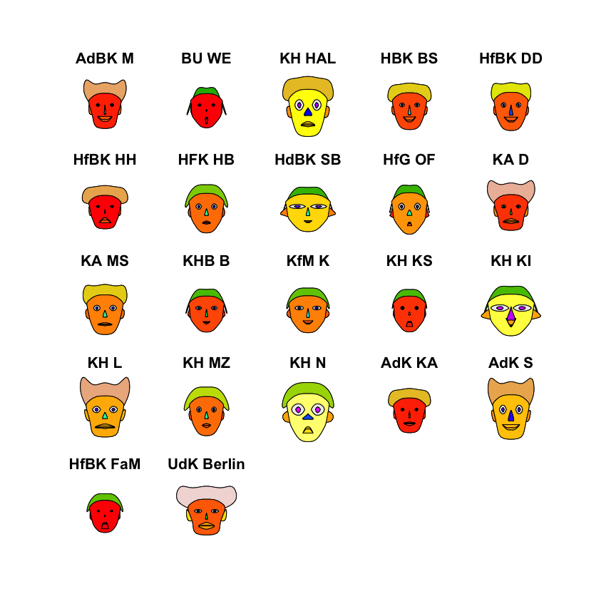
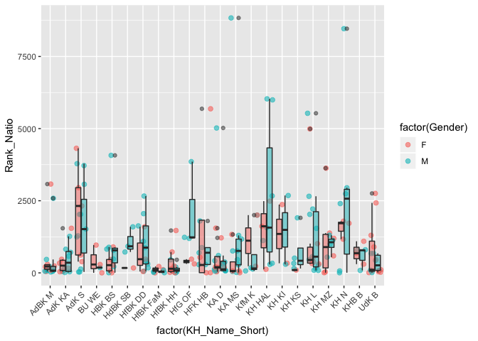

Einleitung
==========

Die von Herman Chernoff (\* 1. Juli 1923) entwickelten *Chernoff-Faces*
(Chernoff 1973) sind ein verfahren der multivariaten
Datenvisualisierung. Im Rahmen er Datenvisualisierung mittels Chernoff
Faces wird die Physiognomie eines cartoonartig simplifizierten,
menschlichen Gesichts (wie z.B. Größe der Ohren, Form des Mundes,
Neigung der Augenbrauen, Größe der Nase usw.) den Merkmalsausprägungen
eines Merkmalsträgers entsprechend geformt. In der Folge erhält jeder
Zeilenvektor eines Datensatzes ein seiner Kombination von
Spaltenvektor-Werten entsprechend strukturiertes Chernoff-Face. Mittels
der je nach Werten auf den Spaltenvekotoren ggf. variierenden
Chernoff-Gesichter können nun die Merkmalsprofile der Zeilenvektoren
untereinander verglichen werden. Eine markante Stärke der
Visualisierungsmethode der Chernoff Faces ist es, dass sie die
menschliche Fähigkeit nutzt, auch kleine Divergenzen oder Konvergenzen
in der Physiognomie menschlicher (bzw. menschenähnlicher) Gesichter zu
registrieren. Da die Physiognomie der Chernoff Faces gewissermaßen
*kurzgeschlossen* ist, mit den Merkmalsausprägungen der jeweiligen
Merkmalsträger, erlaubt die Methode der Chernoff-Faces Ähnlich- bzw.
Unähnlichkeitsstrukturen verschiedener Merkmalsprofile von
Zeilenvektoren leicht und intuitiv zu explorieren.

Problematisch wird die Anwendung der Chernoff Faces bei Datensets (vgl.
Livingstone 2009) mit sehr vielen Zeilenvektoren: Selbstverständlich
sind zwanzig Gesichter leichter zu unterscheiden als zweihundert.

Daten
=====

Der im folgenden zur Illustration verwendete Datensatz weißt für
sämtliche Professor\_innen bundesdeutscher, staatlicher Kunsthochschulen
im Fachbereich bildende Kunst (und angrenzender Fächer) u.a. folgende
Variablen auf:

-   nationale und internationale Rankingposition des
    Künstler\_innen-Rankings ([Artfacts](https://artfacts.net/))
-   Alter
-   Geschlecht

Es können nun in diesen, vorgenannten Dimensionen statistische Profile
für deutsche, alle staatlichen Kunsthochschulen erzeugt werden, die
wiederum mittels der Chernoff Faces visualisiert und exploriert werden
können. Hierzu sollen folgende, einfache Kennzahlen pro Kunsthochschule
berechnet werden:

1.  Mittelwert des globalen Rankings aller Professor\_innen einer
    Kunsthochschule
2.  Mittelwert des nationalen Rankings aller Professor\_innen einer
    Kunsthochschule
3.  Anzahl der Professor\_innen pro Kunsthochschule ingesamt
4.  Anzahl weiblicher Professor\_innen pro Kunsthochschule
5.  Anzahl männlicher Professor\_innen pro Kunsthochschule
6.  Durchschnittsalter aller Professor\_innen pro Kunsthochschule

Datenaufbereitung
=================

In einem ersten Schritt wird für die Datenaufbereitung mittels der
*tidyverse*-Pakete (Wickham 2017) der oben beschriebene Datensatz in die
Arbeitsumgebung geladen. Dies erfolgt hier mit der Funktion
`read_excel()` des Paketes *readxl* (Wickham and Bryan 2019).

``` r
# Lade Datensatz
library(readxl)
df <- read_excel("Fine_Artfacts_Kunsthochschulen.xlsx")
```

Im Rahmen der Datenerhebung der Rankingpositionen war für so gut wie
alle Professor\_innen eine globale Rankingposition einfach zu ermitteln.
Komplizierter ist die Erhebnung der nationalen Rankingposition, die sich
Anfang 2019 bei Artfacts noch an der Geburtsstätte der jeweiligen
Künstler\_in orientierte. Um den Informationsgehalt der Daten nicht
schon im Rahmen der Erhebung zu reduzieren, wurde für jede auftretende
Nationalität ein neuer Spaltenvektor erzeugt, der die jeweilige,
nationale Rankingposition enthält:

``` r
head(df[,14:36])
```

    ## # A tibble: 6 x 23
    ##   Rank_Germany Rank_USA Rank_France Rank_Netherlands Rank_Austria
    ##          <dbl>    <dbl>       <dbl>            <dbl>        <dbl>
    ## 1            7       NA          NA               NA           NA
    ## 2           24       NA          NA               NA           NA
    ## 3           33       NA          NA               NA           NA
    ## 4           34       NA          NA               NA           NA
    ## 5           40       NA          NA               NA           NA
    ## 6           NA       NA          NA               NA           NA
    ## # … with 18 more variables: Rank_Turkey <dbl>, `Rank_United
    ## #   Kingdom` <dbl>, Rank_Italy <dbl>, Rank_Romania <dbl>,
    ## #   Rank_Sweden <dbl>, `Rank_South Africa` <dbl>, Rank_Norway <dbl>,
    ## #   Rank_Finland <dbl>, Rank_Switzerland <dbl>, `Rank_New Zealand` <dbl>,
    ## #   Rank_Mexico <dbl>, Rank_Japan <dbl>, Rank_Australia <dbl>,
    ## #   Rank_Israel <dbl>, Rank_Poland <dbl>, Rank_Canada <dbl>, `Rank_Korea
    ## #   (Republic of)` <dbl>, Rank_Iran <dbl>

Für die folgenden Analysen müssen diese Spaltenvektoren zu einem
einzigen Vektor zusammengefügt werden, der den Namen `Rank_Natio` tragen
soll:

``` r
#Setzt NA auf "" und füge Spalten zusammen
library(tidyverse)
df <- df %>% replace(., is.na(.), "") %>% unite("Rank_Natio", c(14:36))

# Entferne Unterstrich, die durch die unite_Funktion verusacht wurden.
df$Rank_Natio <- str_replace_all(df$Rank_Natio, "(_+)", "") #verwandele "_" (oder mehr) in ""

#ersetze leere String-Zellen durch NA Data-Frame-weit
df <- mutate_all(df, funs(na_if(.,"")))
```

Des Weiteren wurden die Ranking-Variablen als String-Variablen in die
Arbeitsumgebung geladen, der einfachheit halber werden diese einzeln in
numerische Variablen umgewandelt:

``` r
#colnames(df)
df$Rank_Global <- as.numeric(df$Rank_Global)
df$Rank_Natio <- as.numeric(df$Rank_Natio)
df$Kunsthochschule <- as.factor(df$Kunsthochschule)
```

Im folgenden werden nun aggregierte Variablen auf Kunsthochschulebene
erzeugt. Dieses sind, wie oben bereits beschrieben:

1.  Mittelwert des globalen Rankings aller Professor\_innen einer
    Kunsthochschule
2.  Mittelwert des nationalen Rankings aller Professor\_innen einer
    Kunsthochschule
3.  Anzahl der Professor\_innen pro Kunsthochschule ingesamt
4.  Anzahl weiblicher Professor\_innen pro Kunsthochschule
5.  Anzahl männlicher Professor\_innen pro Kunsthochschule
6.  Durchschnittsalter aller Professor\_innen pro Kunsthochschule

``` r
# Erzeuge aggregierte Variablen auf KH-Ebene

# Ranking Durchschnittwerte pro Kunsthochschule
Rank <- df %>% group_by(Kunsthochschule) %>% mutate(Mean_Nat_Rank= mean(Rank_Natio,na.rm = T)) %>% mutate(Mean_Global_Rank = mean(Rank_Global, na.rm = T)) %>%
  summarize(Sum_Nat = round(mean(Mean_Nat_Rank),2), Sum_Glob = round(mean(Mean_Global_Rank),2))

#Anzahl Professoren pro Kunsthochschule
Profs <- df %>% group_by(Kunsthochschule) %>% summarise (n_Profs = n())

# Anzahl geschlecht pro Kunsthochschule
Gender <- df %>% group_by(Kunsthochschule) %>%
  summarise(n_Frau = sum(Gender == "F"), n_Mann = sum(Gender == "M")) 

# Mean_Alter pro Kunsthochschule
df$Alter <- as.numeric(df$Alter)
df$Alter <- 2019-df$Alter
 
Alter <- df %>% group_by(Kunsthochschule) %>% mutate(Mean_Alter= mean(Alter,na.rm = T))  %>%  
  summarize(Mean_Alter_Sum = round(mean(Mean_Alter),2))   

# Datenzusammenführung:
df1 <- merge(Rank,Profs, by="Kunsthochschule")
df2 <- merge(df1,Gender, by="Kunsthochschule")
ArtFac <- merge(df2,Alter, by="Kunsthochschule")

# entferne alle Dataframes außer ArtFac + df
rm(list=setdiff(ls(), c("ArtFac", "df")))
```

Schließlich werden alle Zeilen aus dem Dataframe gefiltert, die einen
oder mehrere Missings auf den Spaltenvektoren aufweisen. Darüberhinaus
werden, um den anschließend zu erzeugenden Chernoff-Faces-Plot
übersichtlich zu gestallten, die Namen der Kunsthochschulen durch
Acronyme ersetzt und als `rownames` spezifiziert.

``` r
# colnames(ArtFac)
# filtere NA-Zeile raus
ArtFac <- ArtFac %>%  filter(!is.na(Sum_Nat))

# Columns in Rownames
ArtFac <- ArtFac %>% remove_rownames %>% column_to_rownames(var="Kunsthochschule")

#rownames(ArtFac)
# ändere Namen der KHs um Faces Plot Übersichtlicher zu gestallten
rownames(ArtFac)[1]<-"AdBK M"
rownames(ArtFac)[2]<-"BU WE"
rownames(ArtFac)[3]<-"KH HAL"
rownames(ArtFac)[4]<-"HBK BS"
rownames(ArtFac)[5]<-"HfBK DD"
rownames(ArtFac)[6]<-"HfBK HH"
rownames(ArtFac)[7]<-"HFK HB"
rownames(ArtFac)[8]<-"HdBK SB"
rownames(ArtFac)[9]<-"HfG OF"
rownames(ArtFac)[10]<-"KA D"

rownames(ArtFac)[11]<-"KA MS" 
rownames(ArtFac)[12]<-"KHB B" 
rownames(ArtFac)[13]<-"KfM K" 
rownames(ArtFac)[14]<-"KH KS" 
rownames(ArtFac)[15]<-"KH KI" 
rownames(ArtFac)[16]<-"KH L" 
rownames(ArtFac)[17]<-"KH MZ" 
rownames(ArtFac)[18]<-"KH N" 
rownames(ArtFac)[19]<-"AdK KA" 
rownames(ArtFac)[20]<-"AdK S" 
rownames(ArtFac)[21]<-"HfBK FaM" 
rownames(ArtFac)[22]<-"UdK Berlin" 
```

Der fertige Dataframe nimmt schließlich folgende Form an:

``` r
library(knitr)
ArtFac %>%
  kable(format = 'markdown') 
```

|            |  Sum\_Nat|  Sum\_Glob|  n\_Profs|  n\_Frau|  n\_Mann|  Mean\_Alter\_Sum|
|:-----------|---------:|----------:|---------:|--------:|--------:|-----------------:|
| AdBK M     |    509.13|    3845.47|        17|        6|       11|             58.76|
| BU WE      |    359.50|    2327.00|         4|        3|        1|             49.50|
| KH HAL     |   2223.50|   18192.20|        14|        6|        8|             54.36|
| HBK BS     |    747.67|    8430.00|        13|        5|        8|             58.92|
| HfBK DD    |    949.25|    7841.25|        12|        3|        9|             59.25|
| HfBK HH    |    251.27|    3525.25|        16|        8|        8|             51.94|
| HFK HB     |   1132.11|    9973.33|         9|        4|        5|             54.89|
| HdBK SB    |    853.25|   32832.40|         5|        2|        3|             56.80|
| HfG OF     |   1413.80|   11350.00|         5|        2|        3|             53.20|
| KA D       |    584.21|    6600.47|        19|        8|       11|             54.32|
| KA MS      |   1161.23|   12924.08|        13|        4|        9|             55.08|
| KHB B      |    624.50|   10828.83|         6|        3|        3|             56.50|
| KfM K      |    768.67|   17749.57|         8|        2|        5|             58.14|
| KH KS      |    599.60|    4157.80|         6|        1|        5|             51.00|
| KH KI      |   1420.25|   36768.60|         6|        3|        3|             62.00|
| KH L       |   1359.82|   16067.94|        18|        6|       12|             54.29|
| KH MZ      |   1080.70|    7809.40|        11|        6|        5|             55.55|
| KH N       |   2367.22|   27328.20|        10|        4|        6|             52.10|
| AdK KA     |    444.64|    3176.14|        14|        6|        8|             55.86|
| AdK S      |   1842.19|   13372.31|        16|        5|       11|             58.25|
| HfBK FaM   |     72.00|     604.57|         8|        3|        5|             49.50|
| UdK Berlin |    596.65|   14717.55|        22|       12|       10|             54.70|

Je niedriger eine Wert eines Rankingprofils, desto besser sind die
Professor\_innen der jeweiligen Kunsthochschule im schnitt gerankt.

Chernoff Faces
==============

Die `faces()`-Funktion des Paketes *aplpack* (Wolf 2019) erzeugt
automatisiert eine Übersicht, welche Variablen welchen Gesichtsregionen
der Chernoff Faces zugeordnet wurden. Deutlich wird dabei, dass, weil
lediglich sechs Variablen spezifiziert wurden, für die restlichen zu
modellierenden Gesichtszüge die abermals selben Variablen verwendet
wurden. Die Färbung der Gesichter erfolgt folgendermaßen: “*For painting
elements of a face the colors of are found by averaging of sets of
variables: (7,8)- eyes:iris, (1,2,3)-lips, (14,15)-ears, (12,13)-nose,
(9,10,11)-hair, (1,2)-face* (Wolf 2019, 9).”

Deutlich wird, mit blick auf die Profile der Rankings bundesdeutscher
Kunsthochschulprofessoren, dass sich die Reputationspole der
Kunsthochschulen durch zwei Extreme auszeichnen: Den Pluspol der
Reputation bilden die Professor\_innen der HfBK Frankfurt am Main (HfBK
FaM), den Minuspol die KH Halle (KH HAL). Je kleiner ein Chernoff Face,
desto stärker nähert sich das Profil der jeweiligen Kunsthochschule dem
positiven Pol der Reputation, und, vice versa, je größer ein Chernoff
Face, desto stärker nähert sich das Profil der jeweiligen
Kunsthochschule dem negativen Pol der Reputation. Ähnlich intuitiv
können nun die weiteren vier Variablen simultan über die verschiedenen
Profile der Kunsthochschulen hinweg verglichen werden.

``` r
library(aplpack)
faces(ArtFac[1:22,],face.type=1)
```



    ## effect of variables:
    ##  modified item       Var             
    ##  "height of face   " "Sum_Nat"       
    ##  "width of face    " "Sum_Glob"      
    ##  "structure of face" "n_Profs"       
    ##  "height of mouth  " "n_Frau"        
    ##  "width of mouth   " "n_Mann"        
    ##  "smiling          " "Mean_Alter_Sum"
    ##  "height of eyes   " "Sum_Nat"       
    ##  "width of eyes    " "Sum_Glob"      
    ##  "height of hair   " "n_Profs"       
    ##  "width of hair   "  "n_Frau"        
    ##  "style of hair   "  "n_Mann"        
    ##  "height of nose  "  "Mean_Alter_Sum"
    ##  "width of nose   "  "Sum_Nat"       
    ##  "width of ear    "  "Sum_Glob"      
    ##  "height of ear   "  "n_Profs"

Weitere Analyse
===============

Um einen etwas genaueren Blick in die Reputationsstruktur der Profile
der Kunsthochschulen zu bekommen, werden abschließend mittels des
Paketes *ggplot2* (Wickham 2016) Boxplots erzeugt, die das nationale und
internationale Rankingprofil der Kunsthochschulen nach Geschlecht
differenzieren soll.

``` r
library(stringr)
colnames(df)
```

    ##  [1] "Name"             "Media"            "Gender"          
    ##  [4] "Nationalitaet"    "Alter"            "Lives_Works"     
    ##  [7] "Most_Exibit_in_1" "Most_Exibit_in_2" "Most_Exibit_in_3"
    ## [10] "Kunsthochschule"  "Fachbereich"      "Death"           
    ## [13] "Rank_Global"      "Rank_Natio"       "Studienfach"     
    ## [16] "Studienort"       "Studium_bei"

``` r
df$KH_Name_Short <- df$Kunsthochschule

df$KH_Name_Short <- df$KH_Name_Short %>%
        str_replace("Akademie der Bildenden Künste München","AdBK M") %>%    
        str_replace("Bauhaus-Universität Weimar","BU WE") %>%
        str_replace("Burg Giebichenstein Kunsthochschule Halle","KH HAL") %>%
        str_replace("HBK Braunschweig","HBK BS") %>%
        str_replace("HfBK Dresden","HfBK DD") %>%  

        str_replace("HfbK Hamburg","HfBK HH") %>%
        str_replace("HFK Bremen","HFK HB") %>%
        str_replace("Hochschule der Bildenden Künste Saar", "HdBK SB") %>%
        str_replace("Hochschule für Gestaltung Offenbach", "HfG OF") %>%
        str_replace("Kunstakademie Düsseldorf","KA D") %>%
        
        str_replace("Kunstakademie Münster","KA MS") %>%
        str_replace("Kunsthochschule Berlin Weißensee","KHB B") %>%
        str_replace("Kunsthochschule für Medien Köln","KfM K") %>%
        str_replace("Kunsthochschule Kassel","KH KS") %>%
        str_replace("Kunsthochschule Kiel","KH KI") %>%
        
        str_replace(" \\(.*\\)", "")  %>% # einzelnd Klammern entfernen, sonst funktioniert str_replace bei  HfBK FaM nicht

        str_replace("Kunsthochschule Leipzig","KH L") %>%
        str_replace("Kunsthochschule Mainz","KH MZ") %>%
        str_replace("Kunsthochschule Nürnberg","KH N") %>%
        str_replace("Staatliche Akademie der Bildenden Künste Karlsruhe","AdK KA") %>%
        str_replace("Staatliche Akademie der Bildenden Künste Stuttgart","AdK S") %>% 
        str_replace("Staatliche Hochschule für Bildende Künste Frankfurt am Main","HfBK FaM") %>%
        str_replace("UdK Berlin","UdK B")

#Gender dichothomisieren:
df$Gender <- df$Gender %>%
        str_replace("M, F","F")  

 df_gg <- df %>% select(Gender,KH_Name_Short,Rank_Global,Rank_Natio) %>% na.omit()

#Rank Global über Khs und Geschlecht
ggplot(df_gg, aes(x=factor(KH_Name_Short), y=Rank_Global, fill=factor(Gender)) ) + 
  #geom_point(size=2, alpha=.6,aes(colour=factor(Gender)))+
  geom_jitter(size=2, alpha=.6,aes(colour=factor(Gender))) +
  geom_boxplot(alpha = 0.5, show.legend = FALSE)+
  theme(axis.text.x = element_text(angle=45, hjust=1))
```


``` r
#Rank National über Khs und Geschlecht
ggplot(df_gg, aes(x=factor(KH_Name_Short), y=Rank_Natio, fill=factor(Gender)) ) + 
  #geom_point(size=2, alpha=.6,aes(colour=factor(Gender)))+
  geom_jitter(size=2, alpha=.6,aes(colour=factor(Gender))) +
  geom_boxplot(alpha = 0.5, show.legend = FALSE)+
  theme(axis.text.x = element_text(angle=45, hjust=1))
```



Eindeutige Geschlechtsunterschiede zeigen die nationalen und
internationalen Rankingprofile der Kunsthochschulen nicht.

Literatur
=========

Chernoff, Herman. 1973. “The Use of Faces to Represent Points in
K-Dimensional Space Graphically.” *Journal of the American Statistical
Association* 68 (342): 361–68.

Livingstone, David. 2009. *A Practical Guide to Scientific Data
Analysis*. Vol. 341. Wiley Online Library.

Wickham, Hadley. 2016. *Ggplot2: Elegant Graphics for Data Analysis*.
Springer-Verlag New York. <https://ggplot2.tidyverse.org>.

———. 2017. *Tidyverse: Easily Install and Load the ’Tidyverse’*.
<https://CRAN.R-project.org/package=tidyverse>.

Wickham, Hadley, and Jennifer Bryan. 2019. *Readxl: Read Excel Files*.
<https://CRAN.R-project.org/package=readxl>.

Wolf, Hans Peter. 2019. *Aplpack: Another Plot Package: ’Bagplots’,
’Iconplots’, ’Summaryplots’, Slider Functions and Others*.
<https://cran.r-project.org/web/packages/aplpack/index.html>.
